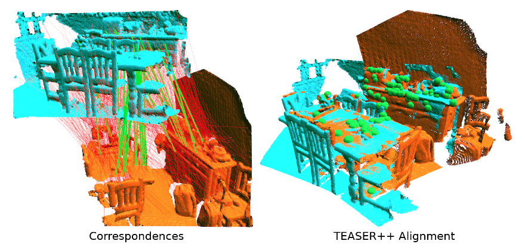

# **Dockerize TEASER++**

TEASER++ is a fast and certifiably-robust point cloud registration library written in C++, with Python and MATLAB bindings. 

I'm very interesting in point cloud registration and I found TEASER++ algorithm in [MIT-SPARK](http://web.mit.edu/sparklab/), please refer to [original repo](https://github.com/MIT-SPARK/TEASER-plusplus). To make it easy to use in my project, I wrapping it with container.


*Left: correspondences generated by 3DSmoothNet (green and red lines represent the inlier and outlier correspondences according to the ground truth respectively). Right: alignment estimated by TEASER++ (green dots represent inliers found by TEASER++).*

In the container including :
 - JupyterLab
 - TensorFlow - GPU
 - CMake v3.19.3
 - Open3D
 - Clang v6.0
 - Python3
 - Others

## **Usage**

```bash
$ sh run-teaser.sh
```

## **Example**

 - [notebook](./notebook/registration-call-script.ipynb)